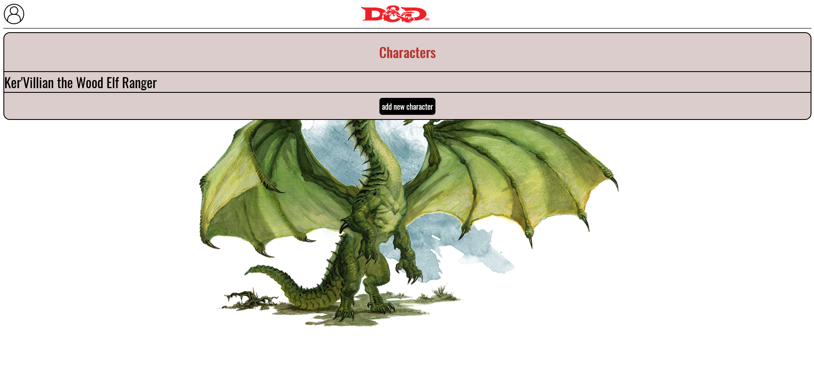
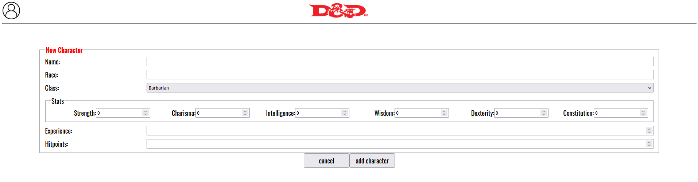
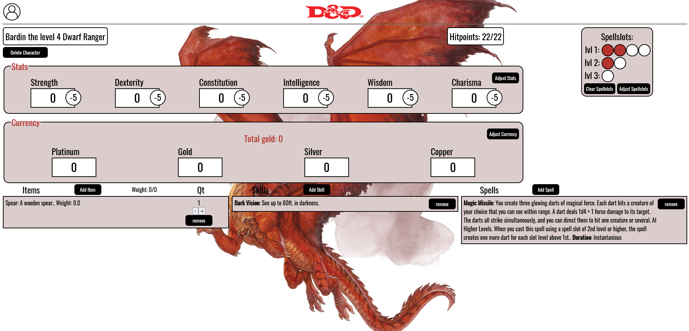

# Dungeons & Data
Dungeons & Data is a project developed to make it simpler to manage all your Dungeons and Dragons Characters! Using a clear and simple GUI helps against your screen getting cluttered with all the different types of information your character sheet needs. Simply create your account and start storing.

Add a new character or select an existing one:

When creating a new character, fill out your details:

After you're done with that, you can see an overview of your character and adjust anything you would like:

